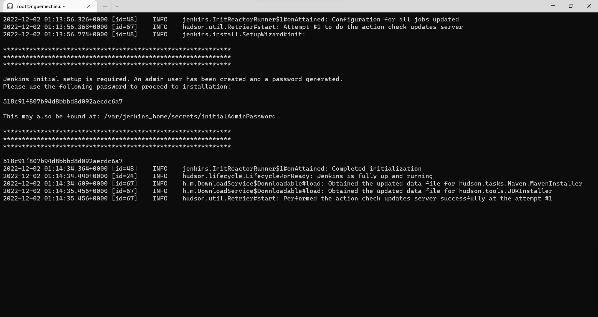

# Jenkins
 
 Running  Jenkins server independently with latest version

 ## Commands: 
  * PULL

     -    docker pull ghcr.io/nguemechieu/jenkins:nightly

  * RUN   commands to execute Jenkins

     -    docker run ghcr.io/nguemecise/jenkins:nightly
    
    
  ### Jenkins Server is running on port 8080
  # [link] http://localhost:8080
  
  # Page Overview
  
  
   
   
   

